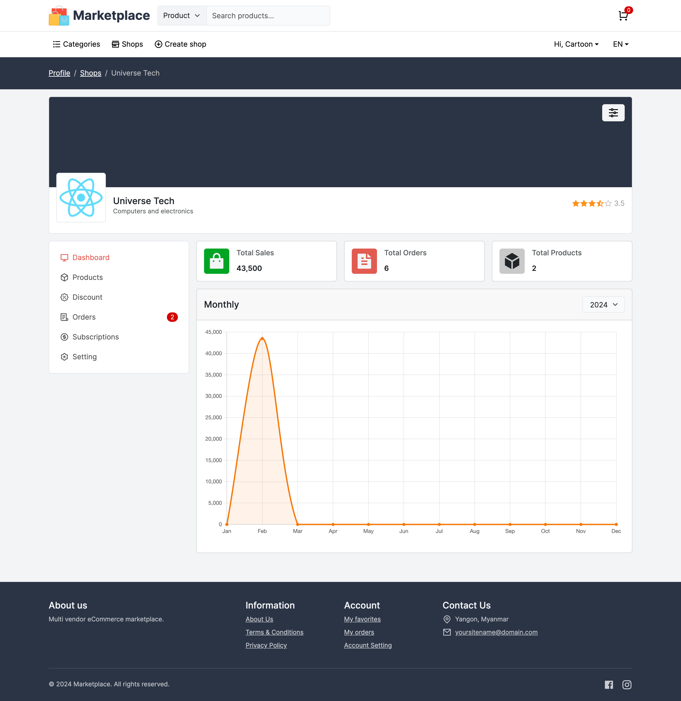
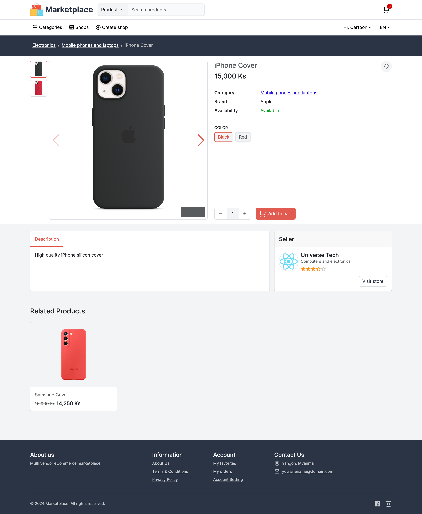
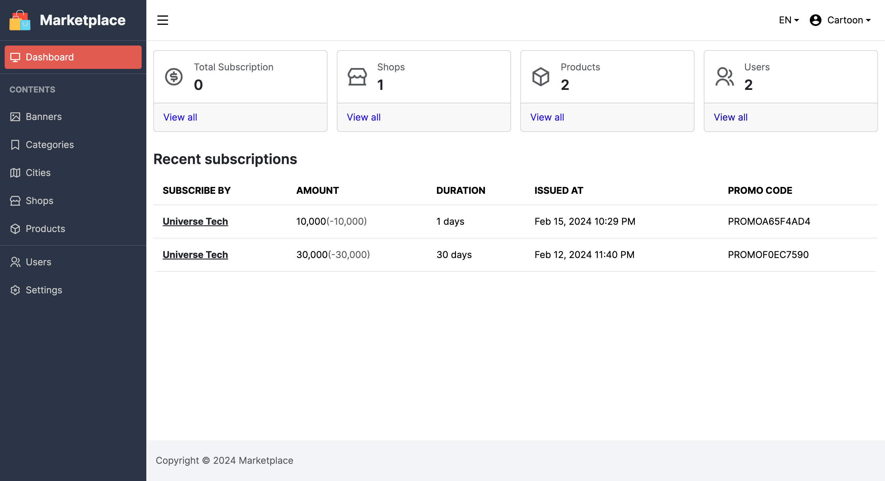

# Multi-vendor marketplace web

Multi-vendor marketplace frontend website build with [Next.js](https://nextjs.org/).

This project is a frontend part of [Multi-vendor marketpalce backend](https://github.com/phyohtetarkar/marketplace-backend/)

## Requirements and setup

<ol>
	<li>Node.js 18.17 or later</li>
	<li>TinyMCE self-hosted</li>
</ol>

This project use [TinyMCE](https://www.tiny.cloud/) for rich text editing. You need to download TinyMCE self-hosted source [here](https://www.tiny.cloud/get-tiny/self-hosted/) and then unzip and place inside **public** folder or you can host anywhere you wish to place. Read more about TinyMCE self-hosted [here](https://www.tiny.cloud/blog/get-started-with-tinymce-self-hosted/).

Required `.env.local` file properties.

```ini

NEXT_PUBLIC_APP_NAME=Marketplace

NEXT_PUBLIC_APP_DESCRIPTION=Multi-vendor marketplace ecommerce website

NEXT_PUBLIC_CONTACT_LOCATION=Yangon, Myanmar

NEXT_PUBLIC_CONTACT_EMAIL=yoursitename@domain.com

NEXT_PUBLIC_BASE_URL= # http://localhost:3000 or (http|https)://yourdomain.com

NEXT_PUBLIC_FIREBASE_API_KEY=
NEXT_PUBLIC_FIREBASE_AUTH_DOMAIN=
NEXT_PUBLIC_FIREBASE_PROJECT_ID=
NEXT_PUBLIC_FIREBASE_APP_ID=

NEXT_PUBLIC_MAP_API_KEY=

NEXT_PUBLIC_API_URL= # backend api url

NEXT_PUBLIC_TINYMCE_SCRIPT_SOURCE=http://localhost:3000/tinymce/tinymce.min.js # Self-hosted TinyMCE source url 

```

## Styling

This project use [Bootstrap 5](https://getbootstrap.com/docs/5.3/getting-started/introduction/) for styling. You can modify bootstrap scss file in `/styles/scss/bootstrap-custom.scss` and then re-compile

```bash
npm run sass
```

## Support me

<a href="https://www.buymeacoffee.com/yzox2vc1i">
	
</a>
<br/>
<br/>


## Screenshots





